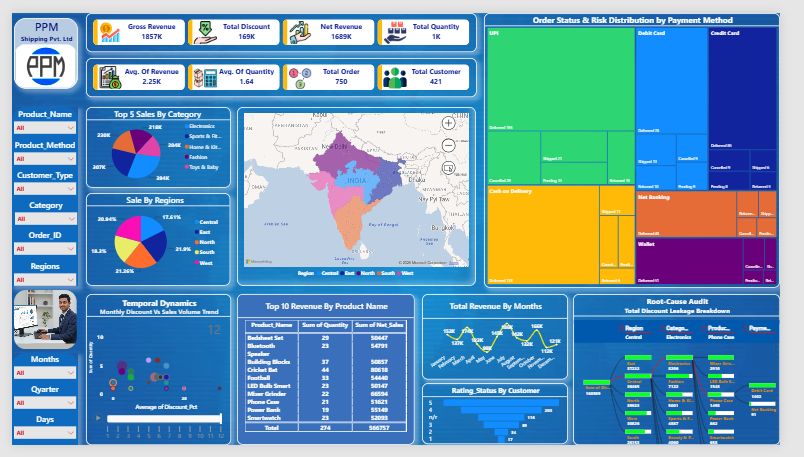

# E-Commerce Sales Dashboard — Power BI

An advanced Power BI dashboard built for **PPM Shipping Pvt. Ltd** to analyze e-commerce sales performance, discount leakage, order status tracking, and regional distribution — with dynamic DAX measures and interactive visuals across multiple business dimensions.

> **Note:** This project uses a synthetic/sample dataset created for portfolio demonstration purposes. It does not represent real confidential business data. **PPM Shipping Pvt. Ltd is a fictional company name used for portfolio demonstration purposes only.**

## 📊 Overview

This dashboard answers key e-commerce business questions:
- What is the Gross Revenue, Net Revenue, and Total Discount impact?
- Which product categories and regions are driving the most sales?
- How are orders distributed by status (Delivered, Shipped, Cancelled, Returned, Pending) across payment methods?
- Where is discount leakage happening — by Region, Category, Product, and Payment Method?
- How does monthly revenue trend across the year?
- What is the customer rating distribution?

## 🛠️ Tools Used

- **Power BI** – Dashboard design, data modeling & interactive visuals
- **DAX** – Custom measures for revenue calculations, dynamic color coding, KPI cards, and discount leakage breakdown
- **Excel** – Source data structuring and preparation
- **Power Query** – Data cleaning and transformation

## 📁 Files in this Repo

| File | Description |
|---|---|
| `E-Commerce_Dashboard.pbix` | Main Power BI dashboard file (data model, DAX measures, and all visuals) |
| `E-Commerce_Data.xlsx` | Source Excel dataset used for the dashboard |
| `E-Commerce_Dashboard.pdf` | Static PDF export of the full dashboard for quick preview |

## 🔑 Key DAX Measures

| Measure | Purpose |
|---|---|
| `Gross Revenue` | Total revenue before discounts |
| `Total Discount` | Aggregate discount applied across all orders |
| `Net Revenue` | Gross Revenue minus Total Discount (actual earned revenue) |
| `Avg. Of Revenue` | Average revenue per order |
| `Avg. Of Quantity` | Average quantity per order |
| `Total Order` | Count of all unique orders |
| `Total Customer` | Count of distinct customers |
| `State Wise Color` | Dynamic DAX color measure for consistent state/region color coding across Geo Map and all regional visuals |
| `Discount Leakage %` | Measures discount loss broken down by Region → Category → Product → Payment Method (Root-Cause Audit) |

## 📈 Dashboard Features

- **KPI Cards** – Gross Revenue (1857K), Total Discount (169K), Net Revenue (1689K), Total Quantity, Total Orders (750), Total Customers (421), Avg Revenue & Quantity
- **Geo Map** – Region-wise sales distribution across India (Central, East, North, South, West) with dynamic state-wise color coding
- **Top 5 Sales By Category** – Pie chart: Electronics, Sports & Fitness, Home & Kitchen, Fashion, Toys & Baby
- **Sale By Regions** – Donut chart showing percentage split across 5 regions
- **Top 10 Revenue By Product** – Table with Sum of Quantity and Net Sales per product
- **Treemap** – Order Status & Risk Distribution by Payment Method (UPI, Cash on Delivery, Debit Card, Credit Card, Net Banking, Wallet) — showing Delivered, Shipped, Cancelled, Returned, Pending breakdown
- **Temporal Dynamics** – Monthly Discount % vs Sales Volume scatter/bubble chart with animated playback
- **Total Revenue By Months** – Line chart showing monthly revenue trends (Jan–Dec)
- **Rating Status By Customer** – Bar chart showing customer rating distribution (1–5 stars)
- **Root-Cause Audit** – Decomposition tree for Total Discount Leakage Breakdown (Region → Category → Product → Payment Method)
- **Slicers** – Product Name, Payment Method, Customer Type, Category, Order ID, Regions, Months, Quarter, Days

## 🚀 How to Use

1. Download `E-Commerce_Dashboard.pbix`
2. Open in **Power BI Desktop**
3. Interact with slicers (Product, Region, Month, Quarter, etc.) to drill down into specific segments
4. Use the Root-Cause Audit decomposition tree to identify where discount leakage is highest
5. Refer to `E-Commerce_Data.xlsx` for source data structure
6. Or view `E-Commerce_Dashboard.pdf` for a quick static preview without Power BI

## 📌 About This Project

This is part of my ongoing Data Analytics portfolio, where I'm building hands-on Power BI projects to strengthen my DAX, data modeling, and dashboard design skills.

Connect with me on [LinkedIn](https://www.linkedin.com/in/niraj-analytics) for more projects and analytics content.

## 📷 Dashboard Preview

  

> 📄 Full report also available as PDF: [E-Commerce_Dashboard.pdf](E-Commerce_Dashboard.pdf)
